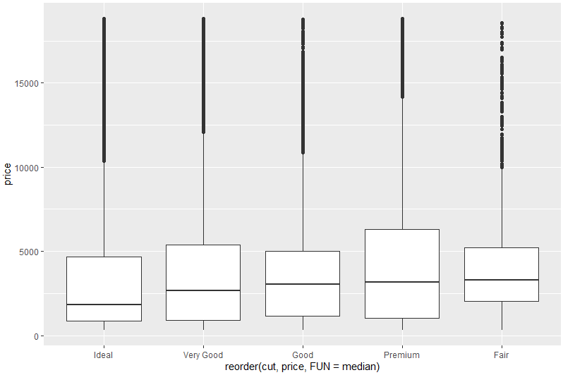

# Welcome to **R** 4 CogPsy

Here you will find everything I have been learning about **R** and statistics. I hope my notes will be useful to other research students struggling with **R** and statistics.

***************************************************************************************************************************************

# Basics #
#### Downloading R ####

Go to [CRAN](https://cloud.r-project.org), the **C**omprehensive **R** **A**rchive **N**etwork, to download **R** for free.


***************************************************************************************************************************************
#### Downloading R Studio ####

Go to [rstudio.com](https://rstudio.com/products/rstudio/) to download **RStudio** for free.

***************************************************************************************************************************************

#### Creating a new project ####


Ideally, a new **RStudio** project should be created for each data analysis project we run. By doing so, we can have everything related to that project (i.e., scripts, plots, data files, etc) all stored in the same location.

To **create a new project**, click on File > New Project > New Directory > New Project

Then, assign a sensible name to the new project and choose the location in your computer in which the project should be saved.

Click on File > Save to save your new **R** script.


***************************************************************************************************************************************

#### Installing packages in **R** ####

   
In order to install a package in **R**, enter the following line of code with the package name you wish to install in the console, and press **enter** to run it. Do not forget to use quotation marks.

```r
install.packages ("rmarkdown")
```

Each package must be installed only once. However, each time you wish to use a previously installed package in a new session, you must reload that package with the `library( )` function:

```r
library (rmarkdown)
```

Occasionally, two different packages may have used the same name for two different functions. If you have both packages loaded in a given session, you need to specify from which package you would like the function to come from. You can do so with the following line of code:

```r
packagename::functionname()
```


***************************************************************************************************************************************

#### Useful **R** packages ####


Below is a list of packages which I have been using for data analysis, data wrangling, and data visualization in **R**:

```r
library (broom)
library (car)
library (devtools)
library (ggplot2)
library (Hmisc)
library (lme4)
library (pastecs)
library (powersim)
library (psych)
library (QuantPsyc)
library (rmarkdown)
library (tidyverse)
```

When sharing a script with others, it is generally recommended to include all the packages needed to run your code. 

To retrieve the **citation information** for a package:

```r
citation("package")$textVersion
```

```r
> citation('lme4')$textVersion
[1] "Douglas Bates, Martin Maechler, Ben Bolker, Steve Walker (2015). Fitting Linear Mixed-Effects Models Using lme4. Journal of Statistical Software, 67(1), 1-48. doi:10.18637/jss.v067.i01."
> 
```


***************************************************************************************************************************************


#### Updating packages in **R** ####

To update all installed **R** packages at once:

```r
update.packages()
```


***************************************************************************************************************************************


#### Using **R** as a calculator ####


One of the simplest and easiest things you can do in **R** is to use it as a calculator. Type the operation in the console, and then press **enter** to run it. If you prefer, you can add the operation to your script/editor window, and press **ALT** + **enter** to run it.

Addition:
```r
1 + 1
```
```r
[1] 2
```

Subtraction:
```r
3 - 1
```
```r
[1] 2
```

Multiplication:
```r
4 * 5
```
```r
[1] 20
```

Division:
```r
40 / 5
```
```r
[1] 8
```

Square root:
```r
sqrt (9)
```
```r
[1] 3
```

Exponentiation:
```r
4^4
```
```r
[1] 256
```

Note that working in the **editor** window rather than in the **console** pane in **R** allows us to save codes and commands which we can then recycle for future use.

***************************************************************************************************************************************

#### Creating variables ####


In **R**, you can easily create `variables` and assign different values to them. By using the symbol `<-`, we assign the value on the right to the `variable` on the left. **Alt** + **-** (minus) can be used as a shortcut for `<-` You can see in the examples below that pretty much anything can be used as a variable's name:

```r
NewVariable <- 2 + 2
Price <- 9.99
Bananas <- 0.50
Apples <- 0.89
reaction_time <- 567
word.count <- 16785
odd_numbers <- c(1,3,5,7)
```

In the last example above, `odd_numbers` is called a **vector**, which in **R** refers to a list of numbers.

`c()` is the **concatenate** function, which allows us to group things together.


The new `variable` will be stored in **R**. Type the variable's name in the **R** console to inspect the value which is associated with it. Note that **R** is case sensitive so be careful when typing any variables' names or commands.

```r
NewVariable
```
```r
[1] 4
```

We can also perform simple mathematical operations with one or more previously stored `variables`:

```r
Bananas * 4
```
```r
[1] 2
```

```r
Bananas + Apples
```
```
[1] 1.39
```

In addition to integers, variables can also contain non-numeric elements in **R**. To create string variables in **R**, we must use quotation marks:

```r
variable1 <- "This entire sentence is a variable."
```

```r
[1] "This entire sentence is a variable."
```

Note that if we place numeric values in quotes, **R** will treat them as text rather than as numbers.

If we would like to find out the number of characters in a given string, we can use the `str_length()` function:

```r
str_length (variable1)
```

```r
[1] 35
```

***************************************************************************************************************************************


#### Useful built-in **R** functions ####

To make regular **sequences** of numbers:
```r
seq (10,30)
```
```r
[1] 10 11 12 13 14 15 16 17 18 19 20 21 22 23 24 25 26 27 28 29 30
```

To **view** an entire dataset:
```r
View(MyDataFrame) # note the capitalized V in this function
```

To check the **first six rows** in a dataset:
```r
head(MyDataFrame)
```
To check the **last six rows** in a dataset:
```r
tail(MyDataFrame)
```

To check whether a value is **missing**:
```r
is.na(variable)
```

To check **how many** values are **missing**:
```r
sum(is.na(variable))
```
Note that, in **R**, `NA` stands for "Not Available".

To generate a sequence of **repeated** numbers:
```r
rep (numberToRepeat, howManyRepetitions)
```

To **create** or **change** an old variable:
```r
ifelse(conditionalArgument, whatToDoIfTrue, WhatToDoIfFalse)
```

To **compute the frequency** of a variable:
```r
table(MyTibble$variable)
```

To **calculate the proportion** of different variables:
```r
FrequencyofVariablesXandY <- table(MyTibble$variable)
prop.table(FrequencyofVariablesXandY)
```

To **check the difference between the minimum and maximum values in a range**:
```r
diff(range(myTibble))
```

To **check all the files in a given directory**:
```r
list.files() # no argument is needed here
```
***************************************************************************************************************************************

#### Useful built-in statistics functions in **R** ####

Mean
```r
mean(variable)
```

Standard deviation
```r
sd(variable)
```

***************************************************************************************************************************************

#### Creating our own functions in **R** ####

If there is not a function readily available in **R** or in any of the available packages to do something we need, we can write our own function. The general format for functions is as follows:

```r
nameOfOurNewFunction <- function(inputObject1, inputObject2, etc)
{ 
   the commands which will do what you want to the input object(s) listed above
   the commands which specify the output of the function
}
```

**Example:**
```r
XmultipliedbyX <- function(variable)
{
  xmultiplied <- variable*variable
  cat("X multiplied by x = ", xmultiplied)
}
```

```r
> XmultipliedbyX (10)
X multiplied by x =  100
```


***************************************************************************************************************************************


#### Useful shortcuts ####

To run the entire script in one step:

**Ctrl** + **Shift** + **S**

To generate a `<-`:

**Alt** + **-**

***************************************************************************************************************************************

#### Importing data files ####

You can use the `read_csv()` function from the **readr** package to open **comma delimited files** (.csv) in **R**:

```r
MyDataFrame <- read_csv("myfile.csv")
```

To open a **tab delimited file** (.txt), you can use the `read_tsv()` function:

```r
MyDataFrame <- read_tsv ("myfile.txt")
```

We can also use the `read.table()` function to open a **.txt** file:

```r
MyDataFrame <- read.table ("myfile.txt", sep = "\t", header = TRUE)
```

To open **files with any delimiter**, you can use the `read_delim()` function:

```r
MyDataFrame <- read_delim ("myfile.txt")
```

If our data file does not contain any column names, by adding `col_names = FALSE` to our line of code, the first row in the data frame will not be treated as a heading.

In case you have not created a project directory with all the files you will be using in your analysis, you need to make sure to specify the whole path where the file(s) you want to open is/are (e.g., "C:/Users/username/Documents/folder/myfile.csv").

If you do not wish to use **readr** to import files, **R** also has built-in functions which allow us to open files with any delimiter:

```r
MyDataFrame <- read.csv("myfile.csv", header = TRUE)
```

```r
MyDataFrame <- read.delim ("myfile.txt", header = TRUE)
```

***************************************************************************************************************************************

#### Exporting data files ####

To save a dataframe as **.csv**:

```r
write_csv(MyDataFrame, "MyDataFrame.csv")
```

To save a dataframe as **.txt**:

```r
write_tsv(MyDataFrame, "MyDataFrame.txt")
```

To save the most recent plot as **.pdf**:

```r
ggsave ("MyDataFrame.pdf") # or .png, .jpeg
```

***************************************************************************************************************************************

#### Combining multiple CSV files ####

In **R**, we can easily combine multiple **.csv** files with only a couple of lines of code:

First, make sure all the files you wish to combine have identical column names. Second, all the **.csv** files you wish to combine must all be stored in the same working directory. Note that there should be no other **.csv** files in that directory. 

```r 
csvFiles <- list.files (pattern="*.csv")
combined.csvFiles <- do.call ("rbind", lapply(csvFiles, read.csv, header = TRUE, fill = TRUE))
```

As previously explained, you can export the combined data as a single **.csv** file:

```r
write.csv (combined.csvFiles, "combinedcsvFiles.csv", row.names=FALSE)
```


***************************************************************************************************************************************


# R Markdown #

With an **R Markdown** document, we can easily share our code, results, and comments with other researchers. **R Markdown** can be used to produce HTML and PDF documents, among other types of output.

To create a new **R Markdown** file, select File > New File > R Markdown.

Insert chunks of code in your **R Markdown** by typing three backticks followed by an **r** inside curly brackets **{}**. Each chunk of code can also be given an optional name. For example:
```r 
'''{r setup, include = FALSE} 
library (ggplot2)
library (tidyverse)
'''
```

If you want to run a given code, but do not want to display the code or the results in the final document, make sure to include a `include = FALSE`.

If you do not want a given chunk of code to be run (e.g., when you wish to share an example code), make sure to include `eval = FALSE` in your **R Markdown**.

If you want to display the results in the **R Markdown** document but not the underlying code, make sure to include `echo = FALSE`.

If you have long computations in your code, it is a good idea to include `cache = TRUE` to save time when re-running a given chunk.


***************************************************************************************************************************************

# Data pre-processing #


**R** has a number of built-in functions which conveniently allows us to pre-process our data. However, some of the most useful **R** packages for data pre-processing can be found in the **tidyverse**, a powerful collection of packages for data science. With a number of different functions from the **tidyverse** package, we can tidy up our dataset before performing any statistical analyses. Among other things, **tidyverse** allows us to subset observations by their values, select the variables we are interested in, and group the data by variable.


Image extracted from [medium.com](https://medium.com/@kadek/how-to-install-the-tidyverse-r-via-homebrew-macos-10-14-d749d2136cf1)


#### Creating tibbles ####

For best results, it is best to convert our data frames to **tibbles**. Tibbles are an improved type of data frame used in all **tidyverse** packages. Unlike regular data frames, each column name in a tibble is also accompanied by its type.

```r
as_tibble (MyDataFrame)
```

If needed, a tibble can always be converted back to a data frame as follows:

```r
as.data.frame(MyTibble)
```


#### Subsetting ####

To **subset** observations by their values:

**Example 1:**

```r
filter(MyTibble, column == value)
```

```r
> filter (diamonds, color == "E")
# A tibble: 9,797 x 10
   carat cut       color clarity depth table price     x     y     z
   <dbl> <ord>     <ord> <ord>   <dbl> <dbl> <int> <dbl> <dbl> <dbl>
 1  0.23 Ideal     E     SI2      61.5    55   326  3.95  3.98  2.43
 2  0.21 Premium   E     SI1      59.8    61   326  3.89  3.84  2.31
 3  0.23 Good      E     VS1      56.9    65   327  4.05  4.07  2.31
 4  0.22 Fair      E     VS2      65.1    61   337  3.87  3.78  2.49
 5  0.2  Premium   E     SI2      60.2    62   345  3.79  3.75  2.27
 6  0.32 Premium   E     I1       60.9    58   345  4.38  4.42  2.68
 7  0.23 Very Good E     VS2      63.8    55   352  3.85  3.92  2.48
 8  0.23 Very Good E     VS1      60.7    59   402  3.97  4.01  2.42
 9  0.23 Very Good E     VS1      59.5    58   402  4.01  4.06  2.4 
10  0.23 Good      E     VS1      64.1    59   402  3.83  3.85  2.46
# ... with 9,787 more rows
```

**Example 2:**

```r
filter(MyTibble, column > value)
```
```r
> filter (diamonds, price > 400)
# A tibble: 53,689 x 10
   carat cut       color clarity depth table price     x     y     z
   <dbl> <ord>     <ord> <ord>   <dbl> <dbl> <int> <dbl> <dbl> <dbl>
 1  0.23 Very Good F     VS1      60      57   402  4     4.03  2.41
 2  0.23 Very Good F     VS1      59.8    57   402  4.04  4.06  2.42
 3  0.23 Very Good E     VS1      60.7    59   402  3.97  4.01  2.42
 4  0.23 Very Good E     VS1      59.5    58   402  4.01  4.06  2.4 
 5  0.23 Very Good D     VS1      61.9    58   402  3.92  3.96  2.44
 6  0.23 Good      F     VS1      58.2    59   402  4.06  4.08  2.37
 7  0.23 Good      E     VS1      64.1    59   402  3.83  3.85  2.46
 8  0.31 Good      H     SI1      64      54   402  4.29  4.31  2.75
 9  0.26 Very Good D     VS2      60.8    59   403  4.13  4.16  2.52
10  0.33 Ideal     I     SI2      61.8    55   403  4.49  4.51  2.78
# ... with 53,679 more rows
```

**Example 3:**

```r
filter(MyTibble, columnA == value1, columnB == value2)
```
```r
> filter (diamonds, color == "E", price == 402)
# A tibble: 6 x 10
  carat cut       color clarity depth table price     x     y     z
  <dbl> <ord>     <ord> <ord>   <dbl> <dbl> <int> <dbl> <dbl> <dbl>
1  0.23 Very Good E     VS1      60.7    59   402  3.97  4.01  2.42
2  0.23 Very Good E     VS1      59.5    58   402  4.01  4.06  2.4 
3  0.23 Good      E     VS1      64.1    59   402  3.83  3.85  2.46
4  0.23 Very Good E     VS2      60.8    58   402  3.98  4.02  2.43
5  0.23 Very Good E     VS2      60.5    58   402  3.92  3.95  2.38
6  0.23 Very Good E     VS2      60.8    58   402  3.97  4.05  2.44
```

**Example 4:**

```r
filter (MyTibble, columnA >=value1, columnB != value2)
```
```r
> filter (diamonds, price >= 18790, color != "E")
# A tibble: 10 x 10
   carat cut       color clarity depth table price     x     y     z
   <dbl> <ord>     <ord> <ord>   <dbl> <dbl> <int> <dbl> <dbl> <dbl>
 1  1.71 Premium   F     VS2      62.3    59 18791  7.57  7.53  4.7 
 2  2.15 Ideal     G     SI2      62.6    54 18791  8.29  8.35  5.21
 3  2.04 Premium   H     SI1      58.1    60 18795  8.37  8.28  4.84
 4  2    Premium   I     VS1      60.8    59 18795  8.13  8.02  4.91
 5  2.29 Premium   I     SI1      61.8    59 18797  8.52  8.45  5.24
 6  2    Very Good H     SI1      62.8    57 18803  7.95  8     5.01
 7  2.07 Ideal     G     SI2      62.5    55 18804  8.2   8.13  5.11
 8  1.51 Ideal     G     IF       61.7    55 18806  7.37  7.41  4.56
 9  2    Very Good G     SI1      63.5    56 18818  7.9   7.97  5.04
10  2.29 Premium   I     VS2      60.8    60 18823  8.5   8.47  5.16
```

**Example 5:**

```r
filter(MyTibble, column %in% c(value1, value2))
```

```r
> filter(flights, carrier %in% c("AA", "DL"))
# A tibble: 80,839 x 19
    year month   day dep_time sched_dep_time dep_delay arr_time sched_arr_time arr_delay
   <int> <int> <int>    <int>          <int>     <dbl>    <int>          <int>     <dbl>
 1  2013     1     1      542            540         2      923            850        33
 2  2013     1     1      554            600        -6      812            837       -25
 3  2013     1     1      558            600        -2      753            745         8
 4  2013     1     1      559            600        -1      941            910        31
 5  2013     1     1      602            610        -8      812            820        -8
 6  2013     1     1      606            610        -4      858            910       -12
 7  2013     1     1      606            610        -4      837            845        -8
 8  2013     1     1      615            615         0      833            842        -9
 9  2013     1     1      623            610        13      920            915         5
10  2013     1     1      628            630        -2     1137           1140        -3
# ... with 80,829 more rows, and 10 more variables: carrier <chr>, flight <int>,
#   tailnum <chr>, origin <chr>, dest <chr>, air_time <dbl>, distance <dbl>, hour <dbl>,
#   minute <dbl>, time_hour <dttm>
```

**Example 6:**

```r
filter(MyTibble, between(column, value1, value2))
```

```r
> filter(mpg, between(year, 1999, 2001))
# A tibble: 117 x 11
   manufacturer model              displ  year   cyl trans      drv     cty   hwy fl    class  
   <chr>        <chr>              <dbl> <int> <int> <chr>      <chr> <int> <int> <chr> <chr>  
 1 audi         a4                   1.8  1999     4 auto(l5)   f        18    29 p     compact
 2 audi         a4                   1.8  1999     4 manual(m5) f        21    29 p     compact
 3 audi         a4                   2.8  1999     6 auto(l5)   f        16    26 p     compact
 4 audi         a4                   2.8  1999     6 manual(m5) f        18    26 p     compact
 5 audi         a4 quattro           1.8  1999     4 manual(m5) 4        18    26 p     compact
 6 audi         a4 quattro           1.8  1999     4 auto(l5)   4        16    25 p     compact
 7 audi         a4 quattro           2.8  1999     6 auto(l5)   4        15    25 p     compact
 8 audi         a4 quattro           2.8  1999     6 manual(m5) 4        17    25 p     compact
 9 audi         a6 quattro           2.8  1999     6 auto(l5)   4        15    24 p     midsize
10 chevrolet    c1500 suburban 2wd   5.7  1999     8 auto(l4)   r        13    17 r     suv    
# ... with 107 more rows
```
#### Reordering ####

To **reorder** the rows in a dataset (i.e., sort by column):

**Example 1:**

```r
arrange(MyTibble, column)
```

```r
> arrange (diamonds, carat)
# A tibble: 53,940 x 10
   carat cut       color clarity depth table price     x     y     z
   <dbl> <ord>     <ord> <ord>   <dbl> <dbl> <int> <dbl> <dbl> <dbl>
 1   0.2 Premium   E     SI2      60.2    62   345  3.79  3.75  2.27
 2   0.2 Premium   E     VS2      59.8    62   367  3.79  3.77  2.26
 3   0.2 Premium   E     VS2      59      60   367  3.81  3.78  2.24
 4   0.2 Premium   E     VS2      61.1    59   367  3.81  3.78  2.32
 5   0.2 Premium   E     VS2      59.7    62   367  3.84  3.8   2.28
 6   0.2 Ideal     E     VS2      59.7    55   367  3.86  3.84  2.3 
 7   0.2 Premium   F     VS2      62.6    59   367  3.73  3.71  2.33
 8   0.2 Ideal     D     VS2      61.5    57   367  3.81  3.77  2.33
 9   0.2 Very Good E     VS2      63.4    59   367  3.74  3.71  2.36
10   0.2 Ideal     E     VS2      62.2    57   367  3.76  3.73  2.33
# ... with 53,930 more rows
```

**Example 2:**

```r
arrange(MyTibble, column1, column2)
```

```r
> arrange (diamonds, carat, depth)
# A tibble: 53,940 x 10
   carat cut     color clarity depth table price     x     y     z
   <dbl> <ord>   <ord> <ord>   <dbl> <dbl> <int> <dbl> <dbl> <dbl>
 1   0.2 Premium E     VS2      59      60   367  3.81  3.78  2.24
 2   0.2 Premium E     VS2      59.7    62   367  3.84  3.8   2.28
 3   0.2 Ideal   E     VS2      59.7    55   367  3.86  3.84  2.3 
 4   0.2 Premium E     VS2      59.8    62   367  3.79  3.77  2.26
 5   0.2 Premium E     SI2      60.2    62   345  3.79  3.75  2.27
 6   0.2 Premium E     VS2      61.1    59   367  3.81  3.78  2.32
 7   0.2 Ideal   D     VS2      61.5    57   367  3.81  3.77  2.33
 8   0.2 Premium D     VS2      61.7    60   367  3.77  3.72  2.31
 9   0.2 Ideal   E     VS2      62.2    57   367  3.76  3.73  2.33
10   0.2 Premium D     VS2      62.3    60   367  3.73  3.68  2.31
# ... with 53,930 more rows
> 
```

#### Selecting ####

To **select** only the columns/variables we are interested in:

**Example 1:**

```r
select(MyTibble, variable1, variable2, variable3)
```

```r
> select (diamonds, carat, cut, color)
# A tibble: 53,940 x 3
   carat cut       color
   <dbl> <ord>     <ord>
 1 0.23  Ideal     E    
 2 0.21  Premium   E    
 3 0.23  Good      E    
 4 0.290 Premium   I    
 5 0.31  Good      J    
 6 0.24  Very Good J    
 7 0.24  Very Good I    
 8 0.26  Very Good H    
 9 0.22  Fair      E    
10 0.23  Very Good H    
# ... with 53,930 more rows
> 
```

**Example 2:**

```r
select(MyTibble, variable1:variable10)
```

```r
> select (flights, year:carrier)
# A tibble: 336,776 x 10
    year month   day dep_time sched_dep_time dep_delay arr_time sched_arr_time arr_delay
   <int> <int> <int>    <int>          <int>     <dbl>    <int>          <int>     <dbl>
 1  2013     1     1      517            515         2      830            819        11
 2  2013     1     1      533            529         4      850            830        20
 3  2013     1     1      542            540         2      923            850        33
 4  2013     1     1      544            545        -1     1004           1022       -18
 5  2013     1     1      554            600        -6      812            837       -25
 6  2013     1     1      554            558        -4      740            728        12
 7  2013     1     1      555            600        -5      913            854        19
 8  2013     1     1      557            600        -3      709            723       -14
 9  2013     1     1      557            600        -3      838            846        -8
10  2013     1     1      558            600        -2      753            745         8
# ... with 336,766 more rows, and 1 more variable: carrier <chr>
> 
```

**Example 3:**

```r
select(MyTibble, -column) # this will select all columns but one
```

```r
> select (diamonds, -color)
# A tibble: 53,940 x 9
   carat cut       clarity depth table price     x     y     z
   <dbl> <ord>     <ord>   <dbl> <dbl> <int> <dbl> <dbl> <dbl>
 1 0.23  Ideal     SI2      61.5    55   326  3.95  3.98  2.43
 2 0.21  Premium   SI1      59.8    61   326  3.89  3.84  2.31
 3 0.23  Good      VS1      56.9    65   327  4.05  4.07  2.31
 4 0.290 Premium   VS2      62.4    58   334  4.2   4.23  2.63
 5 0.31  Good      SI2      63.3    58   335  4.34  4.35  2.75
 6 0.24  Very Good VVS2     62.8    57   336  3.94  3.96  2.48
 7 0.24  Very Good VVS1     62.3    57   336  3.95  3.98  2.47
 8 0.26  Very Good SI1      61.9    55   337  4.07  4.11  2.53
 9 0.22  Fair      VS2      65.1    61   337  3.87  3.78  2.49
10 0.23  Very Good VS1      59.4    61   338  4     4.05  2.39
# ... with 53,930 more rows
> 
```

**Example 4:**

```r
select (MyTibble, -c(variable1, variable2)) # this will select all columns but two
```

```r
> select (diamonds, -c(color, price))
# A tibble: 53,940 x 8
   carat cut       clarity depth table     x     y     z
   <dbl> <ord>     <ord>   <dbl> <dbl> <dbl> <dbl> <dbl>
 1 0.23  Ideal     SI2      61.5    55  3.95  3.98  2.43
 2 0.21  Premium   SI1      59.8    61  3.89  3.84  2.31
 3 0.23  Good      VS1      56.9    65  4.05  4.07  2.31
 4 0.290 Premium   VS2      62.4    58  4.2   4.23  2.63
 5 0.31  Good      SI2      63.3    58  4.34  4.35  2.75
 6 0.24  Very Good VVS2     62.8    57  3.94  3.96  2.48
 7 0.24  Very Good VVS1     62.3    57  3.95  3.98  2.47
 8 0.26  Very Good SI1      61.9    55  4.07  4.11  2.53
 9 0.22  Fair      VS2      65.1    61  3.87  3.78  2.49
10 0.23  Very Good VS1      59.4    61  4     4.05  2.39
# ... with 53,930 more rows
> 
```

**Example 5:**

```r
select(MyTibble, starts_with("string")
```

```r
> select (diamonds, starts_with("c"))
# A tibble: 53,940 x 4
   carat cut       color clarity
   <dbl> <ord>     <ord> <ord>  
 1 0.23  Ideal     E     SI2    
 2 0.21  Premium   E     SI1    
 3 0.23  Good      E     VS1    
 4 0.290 Premium   I     VS2    
 5 0.31  Good      J     SI2    
 6 0.24  Very Good J     VVS2   
 7 0.24  Very Good I     VVS1   
 8 0.26  Very Good H     SI1    
 9 0.22  Fair      E     VS2    
10 0.23  Very Good H     VS1    
# ... with 53,930 more rows
```

The main difference between `select()` and `filter()` is that `select()` allows us to keep only the **variables/columns** we specify, whereas `filter()` allows us to keep only the **observations/rows** we specify.


To **rename** columns/variables:

```r
rename(MyTibble, newname = oldname)
```
```r
rename(flights, departure_time = dep_time)
# A tibble: 336,776 x 19
    year month   day departure_time sched_dep_time dep_delay arr_time sched_arr_time arr_delay
   <int> <int> <int>          <int>          <int>     <dbl>    <int>          <int>     <dbl>
 1  2013     1     1            517            515         2      830            819        11
 2  2013     1     1            533            529         4      850            830        20
 3  2013     1     1            542            540         2      923            850        33
 4  2013     1     1            544            545        -1     1004           1022       -18
 5  2013     1     1            554            600        -6      812            837       -25
 6  2013     1     1            554            558        -4      740            728        12
 7  2013     1     1            555            600        -5      913            854        19
 8  2013     1     1            557            600        -3      709            723       -14
 9  2013     1     1            557            600        -3      838            846        -8
10  2013     1     1            558            600        -2      753            745         8
# ... with 336,766 more rows, and 10 more variables: carrier <chr>, flight <int>,
#   tailnum <chr>, origin <chr>, dest <chr>, air_time <dbl>, distance <dbl>, hour <dbl>,
#   minute <dbl>, time_hour <dttm>
> 
```

To **rename** observations:

```r
MyTibble2 <- MyTibble %>%
  mutate (names_from = stringr::str_replace (columnWhereTheObservationsAre, "previousName", "newName"))
```

```r
> who2 <- who1 %>%
+   mutate (names_from = stringr::str_replace(key, "new", "old"))
> who2
# A tibble: 76,046 x 7
   country     iso2  iso3   year key          cases names_from  
   <chr>       <chr> <chr> <int> <chr>        <int> <chr>       
 1 Afghanistan AF    AFG    1997 new_sp_m014      0 old_sp_m014 
 2 Afghanistan AF    AFG    1997 new_sp_m1524    10 old_sp_m1524
 3 Afghanistan AF    AFG    1997 new_sp_m2534     6 old_sp_m2534
 4 Afghanistan AF    AFG    1997 new_sp_m3544     3 old_sp_m3544
 5 Afghanistan AF    AFG    1997 new_sp_m4554     5 old_sp_m4554
 6 Afghanistan AF    AFG    1997 new_sp_m5564     2 old_sp_m5564
 7 Afghanistan AF    AFG    1997 new_sp_m65       0 old_sp_m65  
 8 Afghanistan AF    AFG    1997 new_sp_f014      5 old_sp_f014 
 9 Afghanistan AF    AFG    1997 new_sp_f1524    38 old_sp_f1524
10 Afghanistan AF    AFG    1997 new_sp_f2534    36 old_sp_f2534
# ... with 76,036 more rows
> 
```


#### Moving columns ####

To **move** columns/variable to the start of the data frame:

```r
select (MyTibble, columntobemoved1, columntobemoved2, everything())
```

```r
> select (diamonds, z, y, x, everything())
# A tibble: 53,940 x 10
       z     y     x carat cut       color clarity depth table price
   <dbl> <dbl> <dbl> <dbl> <ord>     <ord> <ord>   <dbl> <dbl> <int>
 1  2.43  3.98  3.95 0.23  Ideal     E     SI2      61.5    55   326
 2  2.31  3.84  3.89 0.21  Premium   E     SI1      59.8    61   326
 3  2.31  4.07  4.05 0.23  Good      E     VS1      56.9    65   327
 4  2.63  4.23  4.2  0.290 Premium   I     VS2      62.4    58   334
 5  2.75  4.35  4.34 0.31  Good      J     SI2      63.3    58   335
 6  2.48  3.96  3.94 0.24  Very Good J     VVS2     62.8    57   336
 7  2.47  3.98  3.95 0.24  Very Good I     VVS1     62.3    57   336
 8  2.53  4.11  4.07 0.26  Very Good H     SI1      61.9    55   337
 9  2.49  3.78  3.87 0.22  Fair      E     VS2      65.1    61   337
10  2.39  4.05  4    0.23  Very Good H     VS1      59.4    61   338
# ... with 53,930 more rows

```

#### Adding new columns ####


To **add** new variables/columns to a dataset:

**Example 1:**

```r
mutate(MyTibble, 
   newColumn = functionToBePerformed)
```

```r
> mutate (diamonds, 
+         pricepercarat = price / carat)
# A tibble: 53,940 x 11
   carat cut       color clarity depth table price     x     y     z pricepercarat
   <dbl> <ord>     <ord> <ord>   <dbl> <dbl> <int> <dbl> <dbl> <dbl>         <dbl>
 1 0.23  Ideal     E     SI2      61.5    55   326  3.95  3.98  2.43         1417.
 2 0.21  Premium   E     SI1      59.8    61   326  3.89  3.84  2.31         1552.
 3 0.23  Good      E     VS1      56.9    65   327  4.05  4.07  2.31         1422.
 4 0.290 Premium   I     VS2      62.4    58   334  4.2   4.23  2.63         1152.
 5 0.31  Good      J     SI2      63.3    58   335  4.34  4.35  2.75         1081.
 6 0.24  Very Good J     VVS2     62.8    57   336  3.94  3.96  2.48         1400 
 7 0.24  Very Good I     VVS1     62.3    57   336  3.95  3.98  2.47         1400 
 8 0.26  Very Good H     SI1      61.9    55   337  4.07  4.11  2.53         1296.
 9 0.22  Fair      E     VS2      65.1    61   337  3.87  3.78  2.49         1532.
10 0.23  Very Good H     VS1      59.4    61   338  4     4.05  2.39         1470.
# ... with 53,930 more rows
```

**Example 2:**

```r
mutate (MyTibble,
   newColumn = functionToBePerformed,
   newColumn2 = newColumn + functionToBePerformed)
```

```r
> mutate (diamonds,
+         pricepercarat = price/carat, 
+         priceDollars = pricepercarat * 1.25)
# A tibble: 53,940 x 12
   carat cut       color clarity depth table price     x     y     z pricepercarat priceDollars
   <dbl> <ord>     <ord> <ord>   <dbl> <dbl> <int> <dbl> <dbl> <dbl>         <dbl>        <dbl>
 1 0.23  Ideal     E     SI2      61.5    55   326  3.95  3.98  2.43         1417.        1772.
 2 0.21  Premium   E     SI1      59.8    61   326  3.89  3.84  2.31         1552.        1940.
 3 0.23  Good      E     VS1      56.9    65   327  4.05  4.07  2.31         1422.        1777.
 4 0.290 Premium   I     VS2      62.4    58   334  4.2   4.23  2.63         1152.        1440.
 5 0.31  Good      J     SI2      63.3    58   335  4.34  4.35  2.75         1081.        1351.
 6 0.24  Very Good J     VVS2     62.8    57   336  3.94  3.96  2.48         1400         1750 
 7 0.24  Very Good I     VVS1     62.3    57   336  3.95  3.98  2.47         1400         1750 
 8 0.26  Very Good H     SI1      61.9    55   337  4.07  4.11  2.53         1296.        1620.
 9 0.22  Fair      E     VS2      65.1    61   337  3.87  3.78  2.49         1532.        1915.
10 0.23  Very Good H     VS1      59.4    61   338  4     4.05  2.39         1470.        1837.
# ... with 53,930 more rows
> 
```

#### Creating a new dataset ####

To **create a new dataset** with columns generated from another dataset:

```r
transmute (MyTibble, 
   newColumn = functionToBePerformed,
   newColumn2 = newColumn + functionToBePerformed)
```

```r
> transmute (diamonds,
+         pricepercarat = price/carat, 
+         priceDollars = pricepercarat * 1.25)
# A tibble: 53,940 x 2
   pricepercarat priceDollars
           <dbl>        <dbl>
 1         1417.        1772.
 2         1552.        1940.
 3         1422.        1777.
 4         1152.        1440.
 5         1081.        1351.
 6         1400         1750 
 7         1400         1750 
 8         1296.        1620.
 9         1532.        1915.
10         1470.        1837.
# ... with 53,930 more rows
```
#### Grouping ####

To **group** the data by a given variable(s):

```r
group_by (MyTibble, variable1, variable2, variable3)
```


#### Collapsing ####

To **collapse** the data from multiple (repeated) rows to a single row:

```r
NewDataFrame <- group_by (MyTibble, variable1, variable2, variable3)
summarise (NewDataFrame, newcolumn = mean (variable4, na.rm = TRUE)
```
```r
> new_diamonds <- group_by (diamonds, cut, color, clarity)
> summarise (new_diamonds, meanPrice = mean(price, na.rm = TRUE))
# A tibble: 276 x 4
# Groups:   cut, color [35]
   cut   color clarity meanPrice
   <ord> <ord> <ord>       <dbl>
 1 Fair  D     I1          7383 
 2 Fair  D     SI2         4355.
 3 Fair  D     SI1         4273.
 4 Fair  D     VS2         4513.
 5 Fair  D     VS1         2921.
 6 Fair  D     VVS2        3607 
 7 Fair  D     VVS1        4473 
 8 Fair  D     IF          1620.
 9 Fair  E     I1          2095.
10 Fair  E     SI2         4172.
# ... with 266 more rows
```

Conveniently, 'tidyverse' allows us to perform several operations simultaneously with the so-called **pipe**, `%>%`. A shortcut for the **pipe** is **Ctrl** + **shift** + **m**:

```r
NewDataFrame <- MyTibble %>%
   group_by (column1) %>%
   summarise (
   newcolumn1 = functionA,
   newcolumn2 = functionB, 
   newcolumn3 = functionC
   ) %>%
   filter (condition1, condition2)
 ```

```r
> diamonds2 <- diamonds %>%
+   group_by (cut, clarity) %>%
+   summarise (
+     count = n(), #this returns the sample size
+     averageprice = mean(price, na.rm = TRUE),
+     averagedepth = mean(depth, na.rm = TRUE)
+   ) %>%
+   filter (averageprice > 350)
> diamonds2
# A tibble: 40 x 5
# Groups:   cut [5]
   cut   clarity count averageprice averagedepth
   <ord> <ord>   <int>        <dbl>        <dbl>
 1 Fair  I1        210        3704.         65.7
 2 Fair  SI2       466        5174.         64.4
 3 Fair  SI1       408        4208.         63.9
 4 Fair  VS2       261        4175.         63.6
 5 Fair  VS1       170        4165.         62.9
 6 Fair  VVS2       69        3350.         62.8
 7 Fair  VVS1       17        3871.         60.4
 8 Fair  IF          9        1912.         60.1
 9 Good  I1         96        3597.         62.1
10 Good  SI2      1081        4580.         62.2
# ... with 30 more rows
> 
```
Please note that if we don't use the `na.rm` argument, we might end up with a lot of missing values in our dataset. Alternatively, we can also remove any missing values prior to performing any further operations on our dataset:

```r
NewTibble <- MyTibble %>%
  filter (!is.na(column1), !is.na(column2))
```

#### Counting ####

To **count** values in a given dataset:

**Example 1:**
```r
NewTibble <- MyTibble %>%
  group_by(column1) %>%
  summarise (
  newColumn = mean(column2, na.rm = TRUE), 
  newColumn2 = n()
  )
```
```r
> newDiamonds <- diamonds %>%
+   group_by (cut, color, clarity) %>%
+   summarize (
+     averageprice = mean(price, na.rm = TRUE),
+     diamondCount = n()
+     
+   )
> newDiamonds
# A tibble: 276 x 5
# Groups:   cut, color [35]
   cut   color clarity averageprice diamondCount
   <ord> <ord> <ord>          <dbl>        <int>
 1 Fair  D     I1             7383             4
 2 Fair  D     SI2            4355.           56
 3 Fair  D     SI1            4273.           58
 4 Fair  D     VS2            4513.           25
 5 Fair  D     VS1            2921.            5
 6 Fair  D     VVS2           3607             9
 7 Fair  D     VVS1           4473             3
 8 Fair  D     IF             1620.            3
 9 Fair  E     I1             2095.            9
10 Fair  E     SI2            4172.           78
# ... with 266 more rows
> 
```

**Example 2:**

```r
MyTibble %>%
count(variable)
```

```r
> flights %>%
+   count (origin)
# A tibble: 3 x 2
  origin      n
  <chr>   <int>
1 EWR    120835
2 JFK    111279
3 LGA    104662
> 
```

#### Replacing outliers with NAs ####

To replace outliers with missing values:

```r
NewTibble <- MyTibble %>%
  mutate (column = ifelse (function, outputIfTrue, outputIfFalse))
```

```r
diamondsNewDF <- diamonds %>%
  mutate (depth = ifelse (depth <= 44 | depth >= 78, NA, depth))

> summary (diamonds$depth)
   Min. 1st Qu.  Median    Mean 3rd Qu.    Max. 
  43.00   61.00   61.80   61.75   62.50   79.00 
> summary (diamondsNewDF$depth)
   Min. 1st Qu.  Median    Mean 3rd Qu.    Max.    NA's 
  50.80   61.00   61.80   61.75   62.50   73.60       6 
> 
````

#### Making a dataset narrower and longer ####

To make a dataset tidy, sometimes we need to **drop** some columns and **increase** the number of rows.

```r
MyTibble %>%
  pivot_longer(c(column1, column2), names_to = "newcolumn1", values_to = "newcolumn2")
```


#### Making a dataset wider and shorter ####

To make a dataset tidy, sometimes we need to **add** some columns and **decrease** the number of rows.

```r
MyTibble %>%
  pivot_wider (names_from = column1, values_from = column2)
```

#### Separating values from a given column and spreading them into two columns ####

To **separate** the values found in a single column and spread them into two new columns:

```r
MyTibble %>%
 separate (columntobeseparated, into = c("newcolumn1", "newcolumn2", sep ="/", convert = TRUE) #if a backlash is the separator
```

#### Combining multiple columns into a single column ####

To **combine** the values from two existing columns into a new column:

```r
MyTibble %>%
 unite (newColumn, existingColumn1, existingColumn2, sep = "") #otherwise an underscore will be placed between the values
```


***************************************************************************************************************************************

# Data Visualization #

Most statisticians would probably agree that it is generally a good idea to inspect our data visually prior to performing any statistical analysis on them. The go-to **R** package for data visualization is **ggplot2**. With **ggplot2**, we can easily create scatterplots, boxplots, bar charts and a whole range of other plots.

The first thing we do when generating a plot with **ggplot2** is to create a coordinate system to which we can subsequently add layers:

```r
ggplot (data = MyTibble)
```
At least one layer should be added to the function above, otherwise we will have an empty graph. Below you will find some of the possible plots which we can generate with **ggplot2**.

#### Scatterplots ####

Scatterplots are useful to visualise the relationship between two **continuous** variables. If you want to create a **scatterplot**, you can use the function `geom_point( )` which will add data points to the aforementioned coordinate system. 

```r
ggplot(data = MyTibble) + 
  geom_point(mapping = aes(x = variable1, y = variable2))
```


By changing or adding further levels to `aes`, i.e., the aesthetic properties of a scatterplot, we can change the size, the shape or even the colour of the data points. 

```r
ggplot(data = MyTibble) + 
  geom_point(mapping = aes(x = variable1, y = variable2, color = variable3))
```


Some of the `variables` which can be added to `aes` are:
1. `class`
2. `size`
3. `alpha` (this refers to the level of transparency of the points)
4. `shape`
5. `colour`
6. `stroke`
7. `group`
8. `fill`


Below is a list with the possible shapes which can be used in a scatterplot generated with **ggplot2**:


Image extracted from **tidyverse.org**.


```r
ggplot(data = MyTibble) + 
  geom_point(mapping = aes(x = variable1, y = variable2, color = variable3), shape = 2)
```


Please note the plus sign `+` should always come at the end of the line when creating `ggplot2` graphics.


If you wish, you can also subset your dataset and use **ggplot2** to create subplots to display each of the subsets.

```r
ggplot(data = MyTibble) + 
  geom_point(mapping = aes(x = variable1, y = variable2)) + 
  facet_wrap(~ aDiscreteVariable, nrow = 3)
```

`nrow` refers to the number of rows in which you would like the subplots to be displayed.
`ncol` can also be used to change the number of columns in which you would like the subplots to be displayed.


Instead of generating a plot with points, we can use the function `geom_smooth` to create a plot with a smooth line fitted to our data.

```r
ggplot(data = MyTibble) + 
  geom_smooth(mapping = aes(x = variable1, y = variable2))
```


To remove the confidence interval, add `se=FALSE` to the code above.


It is also possible to add points **and** a smooth line to any given scatterplot:

```r
ggplot(data = MyTibble) +
  geom_point(mapping = aes(x = variable1, y = variable2)) +
  geom_smooth(mapping = aes(x = variable1, y = variable2))
```
*or*

```r
ggplot(data = MyTibble, mapping = aes (x = variable1, y= variable2) +
  geom_point()+
  geom_smooth()
```


You can also add different aesthetic values to different layers if you wish:

```r
ggplot(data = MyTibble, mapping = aes (x = variable1, y= variable2) +
  geom_point(mapping = aes(color = variable3)+
  geom_smooth(color = "red")
```


With the function `geom_jitter()` we can add some degree of noise to the datapoints:

```r
ggplot(data = MyTibble, mapping = aes (x = variable1, y= variable2) +
  geom_point(mapping = aes(color = variable3)+
  geom_smooth(color = "red")+
  geom_jitter()
```


We can also add a **title**, a **subtitle**, and a **caption** to any plot with the `labs()` function and/or change the default legend titles in the x and/or y axis.

```r
ggplot(data = MyTibble, mapping = aes (x = variable1, y= variable2) +
  geom_point(mapping = aes(color = variable3)+
  geom_smooth(color = "red")+
  labs(
    title = "Whatever title you wish",
    subtitle = "Additional detail which will be added below the title",
    caption = "Further text which will be added at the bottom right of the plot",
    x = "New legend for the x axis",
    y = "New legend for the y axis"
```


#### Line graphs ####

Line graphs are a very useful tool to display progression of a variable over time. Below you will find an example of a line graph for **one** independent variable created with **ggplot2**:

```r
ggplot (MyTibble, aes (variable1, variable2)) +
 stat_summary (fun.y = mean, geom = "point") +
 stat_summary (fun.y = mean, geom = "line", aes (group = 1), colour = "whateverColour", linetype = "whateverType")+
 stat_summary (fun.data = mean_cl_normal, geom = "errorbar", width = 0.2) +
 labs (x = "Variable1", y = "Variable2)
```

```r
ggplot (Blocks, aes (block, RT)) +
  stat_summary (fun.y = mean, geom = "point") +
  stat_summary (fun.y = mean, geom = "line", aes (group = 1), colour = "Blue", linetype = "dashed") +
  stat_summary (fun.data = mean_cl_normal, geom = "errorbar", width = 0.2) +
  labs (x = "Block", y = "Reaction Time")
```


Note that for categorical variables to be plotted in **R** with the **ggplot2** package, we need to first convert that variable to a **factor** with the `factor()` function.


#### Bar charts ####

We use bar charts to plot the distribution of a **categorical** variable. To generate a bar chart with **ggplot2**, we can use the function `geom_bar`.

```r
ggplot (data = MyTibble) +
  geom_bar (mapping =  aes (x = variable1))
```


In the example above, the y axis displays the number (count) of occurrences of the variable in question. We can also generate a barchart with the proportion of cases in the y axis:

```r
ggplot (data = MyTibble) +
  geom_bar (mapping =  aes (x = variable1, y = stat(prop), group = 1))
```

We can also easily add **error bars** to bar charts in **R**. To do that, we need to add the `stat_summary()` function to our code. Instead of having graphs with the raw values displayed, by adding the `stat_summary()` function to our code, we can have the mean, median, etc in our plots.

Note that when **error bars** don't overlap, we can be confident that our experimental manipulation has been successful. In such cases, it is highly likely that the samples did not come from the same population.

```r
ggplot (data = MyTibble, aes (variable1, variable2)) +
 stat_summary (fun.y = mean, geom = "bar", fill = "whateverColor", color = "whateverColor") +
 stat_summary (fun.data = mean_cl_normal, geom = "errorbar")
```
```r
ggplot (data = experimental, aes (participant, RT)) +
  stat_summary (fun.y = mean, geom = "bar", fill = "white", color = "black") +
  stat_summary (fun.data = mean_cl_normal, geom = "errorbar")
```


Note that `fun.y` is a function specified for individual points, whereas `fun.data` refers to the entire dataset. Also, instead of an **errorbar**, we can add a **pointrange** to our bar chart. Additionally, if you do not want the the error bars to be as wide as the bars, add a `width = 0.2` to the second `stat_summary()` layer above.


Conveniently, bar charts can also be color-coded with the `fill` argument:

```r
ggplot (data = MyTibble) +
geom_bar (mapping = aes (x = variable1, fill = variable1))
```


We can also have a bar chart in which a third variable determines the colors of the bars:

```r
ggplot (data = MyTibble, aes (variable1, variable2, fill = variable3))+
 stat_summary (fun.y = mean, geom = "bar", position = "dodge") +
 stat_summary (fun.data = mean_cl_normal, geom = "errorbar", position = position_dodge (width = 0.90), width = 0.2)
```

```r
ggplot (data = experimental2, aes (participant, RT, fill = gender)) +
  stat_summary (fun.y = mean, geom = "bar", position = "dodge") +
  stat_summary (fun.data = mean_cl_normal, geom = "errorbar", position = position_dodge(width=0.90), width = 0.2)
```


In the example above, `position = "dodge"` ensures that the bars representing the third variable are displayed **side-by-side** rather than behind each other.


Another way to display the above graphically is to add the third variable as a facet rather than as an aesthetic value:

```r
ggplot (MyTibble, aes (variable1, variable2, fill = variable1)) +
  stat_summary (fun.y = mean, geom = "bar") +
  stat_summary (fun.data = mean_cl_normal, geom = "errorbar", width = 0.2) +
  facet_wrap (~variable3)
```

```r
ggplot (experimental2, aes (participant, RT, fill = participant)) +
  stat_summary (fun.y = mean, geom = "bar") +
  stat_summary(fun.data = mean_cl_normal, geom = "errorbar", width = 0.2) +
  facet_wrap(~gender)
```


It may sometimes be hard to read **long labels** when the bars are displayed vertically, as in the example below:

```r
ggplot (data = MyTibble) +
geom_bar (mapping = aes (x = variable1, fill = variable1)
```


To solve that, you can flip your plot so that the bars are displayed horizontally rather than the vertical default.

```r
ggplot(data = MyDataFrame) +
  geom_bar (mapping = aes(x = variable1, fill = variable1) +
  coord_flip ()
```


Instead of a stacked bar chart, we can also display our data as follows:

```r
ggplot (data = MyTibble) +
geom_bar (mapping = aes (x = variable1, fill = variable1) +
coord_polar ()
```


#### Boxplots ####

Boxplots can be used to display the distribution of a continuous variable broken down by a categorical variable. **ggplot2**  allows us to easily create boxplots with the `geom_boxplot()` function.

```r
ggplot(data = MyTibble) +
  geom_boxplot (mapping = aes (x = variable1, y = variable2)
```


The order in which the boxplots are displayed can also be changed in order to reveal interesting patterns:

```r
ggplot(data = MyTibble) +
  geom_boxplot(mapping = aes(x=reorder (variable1, variable2, FUN = median), y = variable2))
```




Below is an illustration extracted from [R for Data Science](https://r4ds.had.co.nz/) showing how to interpret boxplots:


#### Histograms ####

We use histograms to plot the distribution of a **continuous** variable. To generate a histogram, we can use the function `geom_histogram()`.

```r
ggplot (data = MyTibble) +
  geom_histogram (mapping = aes (x = variable1), binwidth = value)
```


#### Frequency polygons ####

With the `geom_freqpoly()` function, we can generate frequency polygons to compare the distribution across the levels of a **categorical** variable:

```r
ggplot(MyTibble, aes (variable1, colour = variable2))+
  geom_freqpoly (binwidth = value)
```

```r
ggplot(diamonds, aes(price, colour = clarity)) +
  geom_freqpoly(binwidth = 250)
```


We can also display the **density** rather than the default **count** in the y axis:

```r
ggplot(diamonds, aes(x = variable1, y =..density..)) +
  geom_freqpoly(mapping = aes (colour = variable2), binwidth = value)
```


***************************************************************************************************************************************

# Proper Stats #

All statistical procedures are a version of the following equation:

outcome<sub>i</sub> = (model) + error<sub>i</sub>

**Sampling distributions:**

- if the population is normally distributed, so is the sampling distribution;
- if the samples contain more than about 50 scores, the sampling distribution should be normally distributed;
- mean of the sampling distribution = mean of the population
- the standard deviation of the sampling distribution = standard deviation of the population divided by the square root of the number of observations in the sample --> standard error

Means vary from sample to sample. When two samples come from the same population, their means should be roughly equal. 

We can use the **standard error** as an indicator of the variability between sample means (small standard errors = similar means; large standard errors = large differences in sample means). The **standard error** is the standard deviation of the sampling distribution.

-----

#### Testing assumptions ####

The assumptions of parametric tests are:

1. Normally distributed data
2. Homogeneity of variance
3. Interval data
4. Independence

One of the ways in which we can check whether whether our data are normally distributed is through visual inspection. There are two graphs which we can generate to perform visual inspection of our data. The first one is a **histogram**:

```r
MyHistogram <- ggplot (MyTibble, aes (variable1)) + opts (legend.position = "none") +
geom_histogram (aes(y = ..density..), colour = "black", fill = "white")+
labs (x = "Whatever label you wish", y = "Density")
```

We must add the `aes(y=..density..)` above because we want a **density** rather than a **frequency** plot. Then we can add the **normal curve** to the histogram above with the `stat_function` command and the `dnorm()` function:

```r
MyHistogram + stat_function (fun = dnorm, args = list (mean = mean(MyTibble$variable1, na.rm = TRUE), 
sd = sd(MyTibble$variable1, na.rm = TRUE)), colour = "black", size = 1)
```

```r
hist.depth <- ggplot(data = diamonds, aes (depth)) +
  geom_histogram(aes(y = ..density..), colour = "black", fill = "white")+
  labs (x = "Price", y = "Density") +
  stat_function(fun = dnorm, args = list(mean(diamonds$depth, na.rm= TRUE), 
  sd = sd(diamonds$depth, na.rm = TRUE)),colour = "black", size = 1)
```


The second graph we can generate to visually inspect whether our data are **normally distributed** is a **Q-Q plot**. In a **Q-Q plot**, any values deviating away from the diagonal of the plot indicate deviations from normality. Ideally, the data points should fall along a straight line.


```r
MyqqPlot <- qplot(sample= MyTibble$variable1, stat = "qq")
```


We can also look at measures of **skewness** and **kurtosis** to check whether our data are **normally distributed**. Values which are very close to zero suggest that the data come from a normal distribution. We can use the `describe()` function from the **psych** package to get the skew and kurtosis values of a given variable:

```r
describe(MyTibble$variable1)
```

```r
> describe(diamonds$depth)
   vars     n  mean   sd median trimmed  mad min max range  skew kurtosis   se
X1    1 53940 61.75 1.43   61.8   61.78 1.04  43  79    36 -0.08     5.74 0.01

> describe(diamonds$price)
   vars     n   mean      sd median trimmed     mad min   max range skew kurtosis    se
X1    1 53940 3932.8 3989.44   2401 3158.99 2475.94 326 18823 18497 1.62     2.18 17.18
> 
```

To test whether a distribution is normal, we can also perform a **Shapiro-Wilk** test in **R** with the `shapiro.test()` function. If the test yields a **non-significant** *p* value, then we can conclude that the distribution in question is **not** significantly different from a **normal distribution**. If, on the other hand, the test yields a significant *p* value, then the distribution in question is significantly different from a normal distribution. 


```r
shapiro.test(MyTibble$variable1)
```

Note that the `shapiro.test()` function only works with sample sizes < 5000. This is because we are likely to get significant results when we have larger sample sizes.


The second assumption for the use of parametric tests is **homogeneity of variance**. To test whether the variances in different groups of data are homogeneous, we can use the **Levene's test**, which in **R** can be performed with the `leveneTest()` function from the **car** package. If the output of a Levene's test is a significant *p* value, then we can conclude that the variances are **not** homogeneous.

```r
leveneTest(MyTibble$outcomeVariable, groupingVariable)
```
***************************************************************************************************************************************

#### Correlations ####

The relationship between two variables can be measured using **correlation coeficients**. There are three main functions in **R** which we can use to compute correlation coefficients, namely `cor()`, `cor.test()`, and `rcorr()` (from the **Hmisc** package).

**Example 1:**
```r
cor(MyTibble$variable1, MyTibble$variable2, use = "what to do with missing values", method = "correlation type")
```

The parameters which we can use in the `use` argument above are:
* "everything" --> an `NA` will be outputted in case there are missing values in the data
* "all.obs" --> an error message will be returned in case there are missing values in the data
* "complete.obs" --> only complete cases for all variables will be included in the computation
* "pairwise.complete.obs" --> computations will only be performed when cases are complete for the two variables in question

The parameters which we can use in the `method` argument above are:
* "pearson"
* "spearman" --> this should be used when the data have violated parametric assumptions
* "kendall" --> this should be used when the data have violated parametric assumptions, and it is best for very small sample sizes

**Example 2:**

```r
rcorr(variable1, variable2, type = "pearson or spearman")
```

**Example 3:**
```r
cor.test(variable1, variable2, alternative = "one or two tailed", type = "correlation type", conf.level = 0.95)
```

The parameters which we can use in the `alternative` argument above are:
* "two.sided" --> this will perform a two-tailed test
* "less" --> this will perform a one-tailed test (if you predict a negative relationship)
* "greater" --> this will perform a one-tailed test (if you predict a positive relationship)


**R<sup>2</sup>** --> this is a measure of the amount of variability in one variable which is also shared by the other variable. In other words, **R<sup>2</sup>** tells us how much variance is explained by the model compared to how much variance there is to explain in the first place. To compute **R<sup>2</sup>** in **R**:

```r
cor(MyTibble$variable1, MyTibble$variable2)^2
```

***************************************************************************************************************************************

#### Regression ####

In **regression analysis**, we fit a linear model to our data, and use that model to predict values of our dependent variable based upon our independent variable(s). If we are trying to predict an outcome variable from only one predictor variable, we use **simple regression**. If, on the other hand, we are trying to predict an outcome variable from several predictor variables, we use **multiple regression**. Since the model we try to fit in regression analysis is linear, our data can be summarized with one straight line (of many). Through the so-called **method of least squares**, we can establish which line best summarizes the data we collected. The best line will be the one which crosses or approaches as many data points as possible. This can be calculated by measuring the vertical distance (i.e., **residuals**) between all the possible lines and each data point in the set. Residuals represent the differences between the values of the outcome predicted by the model and the values of the outcome observed in the sample. If a model fits the sample data well, then all residuals will be small. Conversely, the residuals will be larger whenever a model is a poor fit to the sample data.

In regression analysis, each line has a **slope**, which can be positive or negative, and an **intercept**, which is the point at which the line crosses the y axis of the graph.

To run a simple regression analysis in **R**, we can use the `lm()` function. 

```r
myModel <- lm(outcomeVariable ~ predictorVariable, data = myTibble)
```

```r
myModel <- lm(price ~ depth, data = diamonds)
```
We can then inspect the results of our analysis with the `summary()` function.

```r
summary(myModel)
```

```r
> summary(myModel)

Call:
lm(formula = price ~ depth, data = diamonds)

Residuals:
   Min     1Q Median     3Q    Max 
 -3766  -2986  -1521   1396  14937 

Coefficients:
            Estimate Std. Error t value Pr(>|t|)    
(Intercept)  5763.67     740.56   7.783 7.21e-15 ***
depth         -29.65      11.99  -2.473   0.0134 *  
---
Signif. codes:  0 *** 0.001 ** 0.01 * 0.05 . 0.1   1

Residual standard error: 3989 on 53938 degrees of freedom
Multiple R-squared:  0.0001134,	Adjusted R-squared:  9.483e-05 
F-statistic: 6.115 on 1 and 53938 DF,  p-value: 0.0134
```

If a given variable is said to significantly predict an outcome, then the beta value should be significantly different from zero. The beta value represents the change in the outcome resulting from a unit change in the predictor. In the example above, the beta value is `5763.67`, which is significantly different from zero, as can be seen in the output of the t-statistic: `7.21e-15`.

The F-statistic shown in the output above tells us how much variability the model can explain relative to how much the model can't explain.

Multiple **R<sup>2</sup>** indicates how well a model predicts the observed data. Large values of multiple **R<sup>2</sup>** represent a large correlation between the predicted and observed values of the outcome (which is the opposite of what is happening in the example above). When the model yields a multiple **R<sup>2</sup>** of 1, then we have a model which perfectly predicts the observed data. 

Models can be extended by including several other variables. It is the combination of all these variables that will be used to predict the outcome variable. The more variables we add to a model, the higher the **R<sup>2</sup>** will be. Note that when deciding on which variables to include in a model, we should do our best to prevent two things from happening: 1) **over-fitting**, which essentially means having too many variables in the model that in turn contribute little to predicting the outcome; and 2) **under-fitting**, which is what happens when important predictors are left out of the model.


To run a multiple regression analysis in **R**, we can use the following:

```r
MyModel <- lm(outcomeVariable ~ predictorVariable1 + predictorVariable2, data = MyTibble)`
```

To compare whether different variables have similar degrees of importance in a model, we can use the `lm.beta()` function from the **QuantPsyc** package:

```r
lm.beta(myModel)
```
The above will yield standardized beta values measured in standard deviation units.

If a model is a good fit to the data, that model will have very small confidence intervals. A model that is **not** a good fit will have confidence intervals which cross zero. With the `confint()` function, we can get the confidence intervals for a model:

```r
confint(myModel)
```

Confidence intervals give us the range of the difference that we would expect to include the true difference on 95% of the time (i.e., if we were to re-run the experiment 100 times).


To compare two or more different models, we can use the `anova()` function:

```r
anova(myModel1,myModel2)
```

***************************************************************************************************************************************

#### Logistic regression ####

**Logistic regression** is a type of multiple regression in which the outcome variable is a categorical variable, and the predictor variables are either continuous or categorical variables.
We can use log-likelihood statistic to assess the fit of a logistic regression model. The log-likelihood statistic indicates how much unexplained information there is after the model has been fitted in. The larger the value of the log-likelihood, the more unexplained observations there are in the model.

In **R**, we can do logistic regression with the generalized linear model function `glm()`.

```r
myModel <- glm(outcome ~ predictorVariable, data = MyTibble, family = binomial())
```

In the example above, other possible values for the `family` argument would be Gaussian, poisson, gamma.

```r
Call:
glm(formula = cut ~ price, family = binomial(), data = diamonds, 
    weights = carat)

Deviance Residuals: 
    Min       1Q   Median       3Q      Max  
-5.8148   0.1771   0.2407   0.2881   0.5370  

Coefficients:
             Estimate Std. Error z value Pr(>|z|)    
(Intercept) 3.132e+00  3.991e-02  78.477   <2e-16 ***
price       1.154e-05  5.311e-06   2.173   0.0298 *  
---
Signif. codes:  0 *** 0.001 ** 0.01 * 0.05 . 0.1   1

(Dispersion parameter for binomial family taken to be 1)

    Null deviance: 14219  on 53939  degrees of freedom
Residual deviance: 14214  on 53938  degrees of freedom
AIC: 14602

Number of Fisher Scoring iterations: 6
```
In the output above, `null deviance` = deviance of the model that contains no predictors other than the constant, whereas `residual deviance` = the deviance for the model. In general, the value for the residual deviance should be less than the value associated with the null deviance.

***************************************************************************************************************************************

#### t-test ####


We can use a **t-test** to test whether two group means are different.

- **independent-samples t-test**: used when there are two experimental conditions and different participants assigned to each condition.
- **paired-samples t-test**: used when there are two experimental conditions and the same participants took part in both conditions of the experiment.


To run a **t-test** in **R**, we can use the `t.test()` function. We can add the option `paired=TRUE` to treat the date as dependent, or `paired=FALSE` to treat it as independent.

If the data for the different groups are stored in **one column**, run the following:

```r
newModel <- t.test (outcomeVariable ~ predictorVariable, data = MyTibble, paired = FALSE/TRUE)
```

If the data for the different groups are stored in **two columns**, run the following instead:

```r
newModel <- t.test (group1scores, group2scores, paired = FALSE/TRUE)
```
***************************************************************************************************************************************

#### ANOVA ####

We can use an **ANOVA** to test whether three or more means are the same.

We use **ANOVA** to compare the ratio of systematic variance to unsystematic variance in an experimental study (i.e., the F-ratio).


pg 417


***************************************************************************************************************************************
# **Where my notes come from**

Below you will find a list of some of the resources I have been using to learn **R**:

[Discovering statistics with R](https://uk.sagepub.com/en-gb/eur/discovering-statistics-using-r/book236067)

[R for Data Science](https://r4ds.had.co.nz/)

`library (swirl)` # this is an interactive **R** package that teaches you **R** inside **R**


***************************************************************************************************************************************


[editor on GitHub](https://github.com/simOne3107/R4CogPsy/edit/master/README.md) 
