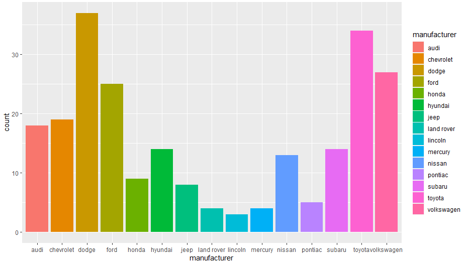

# Welcome to **R** 4 CogPsy

Here you will find everything I have been learning about **R** and statistics. I hope my notes will be useful to other research students struggling with R and statistics.

***************************************************************************************************************************************

# Basics #
## Downloading R ##

Go to [CRAN](https://cloud.r-project.org), the Comprehensive R Archive Network, to download **R** for free.


***************************************************************************************************************************************
## Downloading R Studio

Go to [rstudio.com](https://rstudio.com/products/rstudio/) to download **RStudio** for free.

***************************************************************************************************************************************

## Using **R** as a calculator


One of the simplest and easiest things you can do in R is to use it as a calculator. Type the operation in the console pane, and then press **enter** to run it.

- Addition
```r
1 + 1
```
```r
[1] 2
```

- Subtraction
```r
3 - 1
```
```r
[1] 2
```

- Multiplication
```r
4 * 5
```
```r
[1] 20
```

- Division
```r
40 / 5
```
```r
[1] 8
```

- Square root
```r
sqrt (9)
```
```r
[1] 3
```

- Exponentiation
```r
4^4
```
```r
[1] 256
```


***************************************************************************************************************************************

## Creating variables


In **R**, you can easily create `variables` and assign different values to them. By using the symbol `<-`, we assign the value on its right to the `variable` on its left. You can see in the examples below that pretty much anything can be used as a variable's name:

```r
NewVariable <- 2 + 2
Price <- 9.99
Bananas <- 0.50
Apples <- 0.89
reaction_time <- 567
word.count <- 16785
```
**Alt** + **-** can be used as a shortcut for `<-`


The new `variable` will be stored in **R**. Type the variable's name in the **R** console to inspect the value which is associated with it. Note that **R** is case sensitive so make sure you type any variables' names appropriately.

```r
NewVariable
```
```r
[1] 4
```

You can also perform simple mathematical operations with one or more previously stored `variables`:

```r
Bananas * 4
```
```r
[1] 2
```

```r
Bananas + Apples
```
```
[1] 1.39
```


***************************************************************************************************************************************

## Installing packages in **R** ##

   

In order to install a package in **R**, enter the following line of code in the console pane with the package name you wish to install, and press enter to run it. Do not forget to use quotation marks.

```r
install.packages ("rmarkdown")
```

Each package must be installed only once. However, each time you wish to use a previously installed package in a new session, you must reload that package with the `library( )` function:

```r
library (rmarkdown)
```


***************************************************************************************************************************************

### Useful **R** packages ###


Below is a list of packages which I have been using for data analysis, data wrangling, and data visualization in **R**:

```r
library (broom)
library (ggplot2)
library (lme4)
library (powersim)
library (tidyverse)
```


***************************************************************************************************************************************

## Useful built-in **R** functions ##

1. To make regular **sequences** of numbers:
```r
seq (10,30)
```
```r
[1] 10 11 12 13 14 15 16 17 18 19 20 21 22 23 24 25 26 27 28 29 30
```

2. To view an entire dataset:
```r
View(MyDataFrame) # note the capitalized V in this function
```

3. To check whether a value is missing:
```r
is.na(variable)
```

4. To check how many values are missing:
```r
sum(is.na(variable))
```


***************************************************************************************************************************************

## Useful built-in statistics functions in **R** ##

1. Mean
```r
mean(variable)
```

2. Standard deviation
```r
sd(variable)
```

***************************************************************************************************************************************

## Useful shortcuts ##

1. To run the entire script in one step:

**Ctrl** + **Shift** + **S**

***************************************************************************************************************************************

## Importing data files ##

You can use the `read_csv()` function from the **readr** package to open .csv files in **R**:

```r
MyDataFrame <- read_csv("myfile.csv")
```

To open a .txt file, you can use the `read_delim()` function:

```r
MyDataFrame <- read_delim ("myfile.txt")
```
In case you have not created a project directory with all the files you will be using in your analysis, make sure to specify the whole path where the file(s) you want to open is (e.g., "C:/Users/username/Documents/folder/myfile.csv").

***************************************************************************************************************************************

# Data pre-processing #

With a number of different functions from the **tidyverse** package, we can appropriately pre-process our data before performing any statistical analyses. Among other things, **tidyverse** allows us to subset observations by their values, select the variables we are interested in, and group the data by variable.

## Subsetting ##
1. To **subset** observations by their values:

**Example 1:**

```r
filter(MyDataFrame, column == value)
```

```r
> filter (diamonds, color == "E")
# A tibble: 9,797 x 10
   carat cut       color clarity depth table price     x     y     z
   <dbl> <ord>     <ord> <ord>   <dbl> <dbl> <int> <dbl> <dbl> <dbl>
 1  0.23 Ideal     E     SI2      61.5    55   326  3.95  3.98  2.43
 2  0.21 Premium   E     SI1      59.8    61   326  3.89  3.84  2.31
 3  0.23 Good      E     VS1      56.9    65   327  4.05  4.07  2.31
 4  0.22 Fair      E     VS2      65.1    61   337  3.87  3.78  2.49
 5  0.2  Premium   E     SI2      60.2    62   345  3.79  3.75  2.27
 6  0.32 Premium   E     I1       60.9    58   345  4.38  4.42  2.68
 7  0.23 Very Good E     VS2      63.8    55   352  3.85  3.92  2.48
 8  0.23 Very Good E     VS1      60.7    59   402  3.97  4.01  2.42
 9  0.23 Very Good E     VS1      59.5    58   402  4.01  4.06  2.4 
10  0.23 Good      E     VS1      64.1    59   402  3.83  3.85  2.46
# ... with 9,787 more rows
```

**Example 2:**

```r
filter(MyDataFrame, column > value)
```
```r
> filter (diamonds, price > 400)
# A tibble: 53,689 x 10
   carat cut       color clarity depth table price     x     y     z
   <dbl> <ord>     <ord> <ord>   <dbl> <dbl> <int> <dbl> <dbl> <dbl>
 1  0.23 Very Good F     VS1      60      57   402  4     4.03  2.41
 2  0.23 Very Good F     VS1      59.8    57   402  4.04  4.06  2.42
 3  0.23 Very Good E     VS1      60.7    59   402  3.97  4.01  2.42
 4  0.23 Very Good E     VS1      59.5    58   402  4.01  4.06  2.4 
 5  0.23 Very Good D     VS1      61.9    58   402  3.92  3.96  2.44
 6  0.23 Good      F     VS1      58.2    59   402  4.06  4.08  2.37
 7  0.23 Good      E     VS1      64.1    59   402  3.83  3.85  2.46
 8  0.31 Good      H     SI1      64      54   402  4.29  4.31  2.75
 9  0.26 Very Good D     VS2      60.8    59   403  4.13  4.16  2.52
10  0.33 Ideal     I     SI2      61.8    55   403  4.49  4.51  2.78
# ... with 53,679 more rows
```

**Example 3:**

```r
filter(MyDataFrame, columnA == value1, columnB == value2)
```
```r
> filter (diamonds, color == "E", price == 402)
# A tibble: 6 x 10
  carat cut       color clarity depth table price     x     y     z
  <dbl> <ord>     <ord> <ord>   <dbl> <dbl> <int> <dbl> <dbl> <dbl>
1  0.23 Very Good E     VS1      60.7    59   402  3.97  4.01  2.42
2  0.23 Very Good E     VS1      59.5    58   402  4.01  4.06  2.4 
3  0.23 Good      E     VS1      64.1    59   402  3.83  3.85  2.46
4  0.23 Very Good E     VS2      60.8    58   402  3.98  4.02  2.43
5  0.23 Very Good E     VS2      60.5    58   402  3.92  3.95  2.38
6  0.23 Very Good E     VS2      60.8    58   402  3.97  4.05  2.44
```

**Example 4:**

```r
filter (MyDataFrame, columnA >=value1, columnB != value2)
```
```r
> filter (diamonds, price >= 18790, color != "E")
# A tibble: 10 x 10
   carat cut       color clarity depth table price     x     y     z
   <dbl> <ord>     <ord> <ord>   <dbl> <dbl> <int> <dbl> <dbl> <dbl>
 1  1.71 Premium   F     VS2      62.3    59 18791  7.57  7.53  4.7 
 2  2.15 Ideal     G     SI2      62.6    54 18791  8.29  8.35  5.21
 3  2.04 Premium   H     SI1      58.1    60 18795  8.37  8.28  4.84
 4  2    Premium   I     VS1      60.8    59 18795  8.13  8.02  4.91
 5  2.29 Premium   I     SI1      61.8    59 18797  8.52  8.45  5.24
 6  2    Very Good H     SI1      62.8    57 18803  7.95  8     5.01
 7  2.07 Ideal     G     SI2      62.5    55 18804  8.2   8.13  5.11
 8  1.51 Ideal     G     IF       61.7    55 18806  7.37  7.41  4.56
 9  2    Very Good G     SI1      63.5    56 18818  7.9   7.97  5.04
10  2.29 Premium   I     VS2      60.8    60 18823  8.5   8.47  5.16
```

**Example 5:**

```r
filter(MyDataFrame, column %in% c(value1, value2))
```

```r
> filter(flights, carrier %in% c("AA", "DL"))
# A tibble: 80,839 x 19
    year month   day dep_time sched_dep_time dep_delay arr_time sched_arr_time arr_delay
   <int> <int> <int>    <int>          <int>     <dbl>    <int>          <int>     <dbl>
 1  2013     1     1      542            540         2      923            850        33
 2  2013     1     1      554            600        -6      812            837       -25
 3  2013     1     1      558            600        -2      753            745         8
 4  2013     1     1      559            600        -1      941            910        31
 5  2013     1     1      602            610        -8      812            820        -8
 6  2013     1     1      606            610        -4      858            910       -12
 7  2013     1     1      606            610        -4      837            845        -8
 8  2013     1     1      615            615         0      833            842        -9
 9  2013     1     1      623            610        13      920            915         5
10  2013     1     1      628            630        -2     1137           1140        -3
# ... with 80,829 more rows, and 10 more variables: carrier <chr>, flight <int>,
#   tailnum <chr>, origin <chr>, dest <chr>, air_time <dbl>, distance <dbl>, hour <dbl>,
#   minute <dbl>, time_hour <dttm>
```

**Example 6:**

```r
filter(MyDataFrame, between(column, value1, value2))
```

```r
> filter(mpg, between(year, 1999, 2001))
# A tibble: 117 x 11
   manufacturer model              displ  year   cyl trans      drv     cty   hwy fl    class  
   <chr>        <chr>              <dbl> <int> <int> <chr>      <chr> <int> <int> <chr> <chr>  
 1 audi         a4                   1.8  1999     4 auto(l5)   f        18    29 p     compact
 2 audi         a4                   1.8  1999     4 manual(m5) f        21    29 p     compact
 3 audi         a4                   2.8  1999     6 auto(l5)   f        16    26 p     compact
 4 audi         a4                   2.8  1999     6 manual(m5) f        18    26 p     compact
 5 audi         a4 quattro           1.8  1999     4 manual(m5) 4        18    26 p     compact
 6 audi         a4 quattro           1.8  1999     4 auto(l5)   4        16    25 p     compact
 7 audi         a4 quattro           2.8  1999     6 auto(l5)   4        15    25 p     compact
 8 audi         a4 quattro           2.8  1999     6 manual(m5) 4        17    25 p     compact
 9 audi         a6 quattro           2.8  1999     6 auto(l5)   4        15    24 p     midsize
10 chevrolet    c1500 suburban 2wd   5.7  1999     8 auto(l4)   r        13    17 r     suv    
# ... with 107 more rows
```
## Reordering ##

2. To **reorder** the rows in a dataset (i.e., sort by column):

**Example 1:**

```r
arrange(MyDataFrame, column)
```

```r
> arrange (diamonds, carat)
# A tibble: 53,940 x 10
   carat cut       color clarity depth table price     x     y     z
   <dbl> <ord>     <ord> <ord>   <dbl> <dbl> <int> <dbl> <dbl> <dbl>
 1   0.2 Premium   E     SI2      60.2    62   345  3.79  3.75  2.27
 2   0.2 Premium   E     VS2      59.8    62   367  3.79  3.77  2.26
 3   0.2 Premium   E     VS2      59      60   367  3.81  3.78  2.24
 4   0.2 Premium   E     VS2      61.1    59   367  3.81  3.78  2.32
 5   0.2 Premium   E     VS2      59.7    62   367  3.84  3.8   2.28
 6   0.2 Ideal     E     VS2      59.7    55   367  3.86  3.84  2.3 
 7   0.2 Premium   F     VS2      62.6    59   367  3.73  3.71  2.33
 8   0.2 Ideal     D     VS2      61.5    57   367  3.81  3.77  2.33
 9   0.2 Very Good E     VS2      63.4    59   367  3.74  3.71  2.36
10   0.2 Ideal     E     VS2      62.2    57   367  3.76  3.73  2.33
# ... with 53,930 more rows
```

**Example 2:**

```r
arrange(MyDataFrame, column1, column2)
```

```r
> arrange (diamonds, carat, depth)
# A tibble: 53,940 x 10
   carat cut     color clarity depth table price     x     y     z
   <dbl> <ord>   <ord> <ord>   <dbl> <dbl> <int> <dbl> <dbl> <dbl>
 1   0.2 Premium E     VS2      59      60   367  3.81  3.78  2.24
 2   0.2 Premium E     VS2      59.7    62   367  3.84  3.8   2.28
 3   0.2 Ideal   E     VS2      59.7    55   367  3.86  3.84  2.3 
 4   0.2 Premium E     VS2      59.8    62   367  3.79  3.77  2.26
 5   0.2 Premium E     SI2      60.2    62   345  3.79  3.75  2.27
 6   0.2 Premium E     VS2      61.1    59   367  3.81  3.78  2.32
 7   0.2 Ideal   D     VS2      61.5    57   367  3.81  3.77  2.33
 8   0.2 Premium D     VS2      61.7    60   367  3.77  3.72  2.31
 9   0.2 Ideal   E     VS2      62.2    57   367  3.76  3.73  2.33
10   0.2 Premium D     VS2      62.3    60   367  3.73  3.68  2.31
# ... with 53,930 more rows
> 
```

## Selecting ##
3. To **select** only the columns/variables we are interested in:

**Example 1:**

```r
select(MyDataFrame, variable1, variable2, variable3)
```

```r
> select (diamonds, carat, cut, color)
# A tibble: 53,940 x 3
   carat cut       color
   <dbl> <ord>     <ord>
 1 0.23  Ideal     E    
 2 0.21  Premium   E    
 3 0.23  Good      E    
 4 0.290 Premium   I    
 5 0.31  Good      J    
 6 0.24  Very Good J    
 7 0.24  Very Good I    
 8 0.26  Very Good H    
 9 0.22  Fair      E    
10 0.23  Very Good H    
# ... with 53,930 more rows
> 
```

**Example 2:**

```r
select(MyDataFrame, variable1:variable10)
```

```r
> select (flights, year:carrier)
# A tibble: 336,776 x 10
    year month   day dep_time sched_dep_time dep_delay arr_time sched_arr_time arr_delay
   <int> <int> <int>    <int>          <int>     <dbl>    <int>          <int>     <dbl>
 1  2013     1     1      517            515         2      830            819        11
 2  2013     1     1      533            529         4      850            830        20
 3  2013     1     1      542            540         2      923            850        33
 4  2013     1     1      544            545        -1     1004           1022       -18
 5  2013     1     1      554            600        -6      812            837       -25
 6  2013     1     1      554            558        -4      740            728        12
 7  2013     1     1      555            600        -5      913            854        19
 8  2013     1     1      557            600        -3      709            723       -14
 9  2013     1     1      557            600        -3      838            846        -8
10  2013     1     1      558            600        -2      753            745         8
# ... with 336,766 more rows, and 1 more variable: carrier <chr>
> 
```

**Example 3:**

```r
select(MyDataFrame, -column) # this will select all columns but one
```

```r
> select (diamonds, -color)
# A tibble: 53,940 x 9
   carat cut       clarity depth table price     x     y     z
   <dbl> <ord>     <ord>   <dbl> <dbl> <int> <dbl> <dbl> <dbl>
 1 0.23  Ideal     SI2      61.5    55   326  3.95  3.98  2.43
 2 0.21  Premium   SI1      59.8    61   326  3.89  3.84  2.31
 3 0.23  Good      VS1      56.9    65   327  4.05  4.07  2.31
 4 0.290 Premium   VS2      62.4    58   334  4.2   4.23  2.63
 5 0.31  Good      SI2      63.3    58   335  4.34  4.35  2.75
 6 0.24  Very Good VVS2     62.8    57   336  3.94  3.96  2.48
 7 0.24  Very Good VVS1     62.3    57   336  3.95  3.98  2.47
 8 0.26  Very Good SI1      61.9    55   337  4.07  4.11  2.53
 9 0.22  Fair      VS2      65.1    61   337  3.87  3.78  2.49
10 0.23  Very Good VS1      59.4    61   338  4     4.05  2.39
# ... with 53,930 more rows
> 
```

**Example 4:**

```r
select (MyDataFrame, -c(variable1, variable2)) # this will select all columns but two
```

```r
> select (diamonds, -c(color, price))
# A tibble: 53,940 x 8
   carat cut       clarity depth table     x     y     z
   <dbl> <ord>     <ord>   <dbl> <dbl> <dbl> <dbl> <dbl>
 1 0.23  Ideal     SI2      61.5    55  3.95  3.98  2.43
 2 0.21  Premium   SI1      59.8    61  3.89  3.84  2.31
 3 0.23  Good      VS1      56.9    65  4.05  4.07  2.31
 4 0.290 Premium   VS2      62.4    58  4.2   4.23  2.63
 5 0.31  Good      SI2      63.3    58  4.34  4.35  2.75
 6 0.24  Very Good VVS2     62.8    57  3.94  3.96  2.48
 7 0.24  Very Good VVS1     62.3    57  3.95  3.98  2.47
 8 0.26  Very Good SI1      61.9    55  4.07  4.11  2.53
 9 0.22  Fair      VS2      65.1    61  3.87  3.78  2.49
10 0.23  Very Good VS1      59.4    61  4     4.05  2.39
# ... with 53,930 more rows
> 
```

**Example 5:**

```r
select(MyDataFrame, starts_with("string")
```

```r
> select (diamonds, starts_with("c"))
# A tibble: 53,940 x 4
   carat cut       color clarity
   <dbl> <ord>     <ord> <ord>  
 1 0.23  Ideal     E     SI2    
 2 0.21  Premium   E     SI1    
 3 0.23  Good      E     VS1    
 4 0.290 Premium   I     VS2    
 5 0.31  Good      J     SI2    
 6 0.24  Very Good J     VVS2   
 7 0.24  Very Good I     VVS1   
 8 0.26  Very Good H     SI1    
 9 0.22  Fair      E     VS2    
10 0.23  Very Good H     VS1    
# ... with 53,930 more rows
```

The main difference between `select()` and `filter()` is that `select()` allows us to keep only the **variables/columns** we specify, whereas 'filter()` allows us to keep only the **observations/rows** we specify.

4. To **rename** columns/variables:

```r
rename(MyDataFrame, newname = oldname)
```
```r
rename(flights, departure_time = dep_time)
# A tibble: 336,776 x 19
    year month   day departure_time sched_dep_time dep_delay arr_time sched_arr_time arr_delay
   <int> <int> <int>          <int>          <int>     <dbl>    <int>          <int>     <dbl>
 1  2013     1     1            517            515         2      830            819        11
 2  2013     1     1            533            529         4      850            830        20
 3  2013     1     1            542            540         2      923            850        33
 4  2013     1     1            544            545        -1     1004           1022       -18
 5  2013     1     1            554            600        -6      812            837       -25
 6  2013     1     1            554            558        -4      740            728        12
 7  2013     1     1            555            600        -5      913            854        19
 8  2013     1     1            557            600        -3      709            723       -14
 9  2013     1     1            557            600        -3      838            846        -8
10  2013     1     1            558            600        -2      753            745         8
# ... with 336,766 more rows, and 10 more variables: carrier <chr>, flight <int>,
#   tailnum <chr>, origin <chr>, dest <chr>, air_time <dbl>, distance <dbl>, hour <dbl>,
#   minute <dbl>, time_hour <dttm>
> 
```
## Moving columns ##

5. To **move** columns/variable to the start of the data frame:

```r
select (diamonds, columntobemoved1, columntobemoved2, everything())
```
```r
> select (diamonds, z, y, x, everything())
# A tibble: 53,940 x 10
       z     y     x carat cut       color clarity depth table price
   <dbl> <dbl> <dbl> <dbl> <ord>     <ord> <ord>   <dbl> <dbl> <int>
 1  2.43  3.98  3.95 0.23  Ideal     E     SI2      61.5    55   326
 2  2.31  3.84  3.89 0.21  Premium   E     SI1      59.8    61   326
 3  2.31  4.07  4.05 0.23  Good      E     VS1      56.9    65   327
 4  2.63  4.23  4.2  0.290 Premium   I     VS2      62.4    58   334
 5  2.75  4.35  4.34 0.31  Good      J     SI2      63.3    58   335
 6  2.48  3.96  3.94 0.24  Very Good J     VVS2     62.8    57   336
 7  2.47  3.98  3.95 0.24  Very Good I     VVS1     62.3    57   336
 8  2.53  4.11  4.07 0.26  Very Good H     SI1      61.9    55   337
 9  2.49  3.78  3.87 0.22  Fair      E     VS2      65.1    61   337
10  2.39  4.05  4    0.23  Very Good H     VS1      59.4    61   338
# ... with 53,930 more rows

```

## Adding new columns ##


6. To **add** new variables/columns to a dataset:

**Example 1:**

```r
mutate(MyDataFrame, 
   newColumn = functionToBePerformed)
```

```r
> mutate (diamonds, 
+         pricepercarat = price / carat)
# A tibble: 53,940 x 11
   carat cut       color clarity depth table price     x     y     z pricepercarat
   <dbl> <ord>     <ord> <ord>   <dbl> <dbl> <int> <dbl> <dbl> <dbl>         <dbl>
 1 0.23  Ideal     E     SI2      61.5    55   326  3.95  3.98  2.43         1417.
 2 0.21  Premium   E     SI1      59.8    61   326  3.89  3.84  2.31         1552.
 3 0.23  Good      E     VS1      56.9    65   327  4.05  4.07  2.31         1422.
 4 0.290 Premium   I     VS2      62.4    58   334  4.2   4.23  2.63         1152.
 5 0.31  Good      J     SI2      63.3    58   335  4.34  4.35  2.75         1081.
 6 0.24  Very Good J     VVS2     62.8    57   336  3.94  3.96  2.48         1400 
 7 0.24  Very Good I     VVS1     62.3    57   336  3.95  3.98  2.47         1400 
 8 0.26  Very Good H     SI1      61.9    55   337  4.07  4.11  2.53         1296.
 9 0.22  Fair      E     VS2      65.1    61   337  3.87  3.78  2.49         1532.
10 0.23  Very Good H     VS1      59.4    61   338  4     4.05  2.39         1470.
# ... with 53,930 more rows
```

**Example 2:**

```r
mutate (MyDataFrame,
   newColumn = functionToBePerformed,
   newColumn2 = newColumn + functionToBePerformed)
```

```r
> mutate (diamonds,
+         pricepercarat = price/carat, 
+         priceDollars = pricepercarat * 1.25)
# A tibble: 53,940 x 12
   carat cut       color clarity depth table price     x     y     z pricepercarat priceDollars
   <dbl> <ord>     <ord> <ord>   <dbl> <dbl> <int> <dbl> <dbl> <dbl>         <dbl>        <dbl>
 1 0.23  Ideal     E     SI2      61.5    55   326  3.95  3.98  2.43         1417.        1772.
 2 0.21  Premium   E     SI1      59.8    61   326  3.89  3.84  2.31         1552.        1940.
 3 0.23  Good      E     VS1      56.9    65   327  4.05  4.07  2.31         1422.        1777.
 4 0.290 Premium   I     VS2      62.4    58   334  4.2   4.23  2.63         1152.        1440.
 5 0.31  Good      J     SI2      63.3    58   335  4.34  4.35  2.75         1081.        1351.
 6 0.24  Very Good J     VVS2     62.8    57   336  3.94  3.96  2.48         1400         1750 
 7 0.24  Very Good I     VVS1     62.3    57   336  3.95  3.98  2.47         1400         1750 
 8 0.26  Very Good H     SI1      61.9    55   337  4.07  4.11  2.53         1296.        1620.
 9 0.22  Fair      E     VS2      65.1    61   337  3.87  3.78  2.49         1532.        1915.
10 0.23  Very Good H     VS1      59.4    61   338  4     4.05  2.39         1470.        1837.
# ... with 53,930 more rows
> 
```

## Creating a new dataset ##

7. To **create a new dataset** with columns generated from another dataset:

```r
transmute (MyDataFrame, 
   newColumn = functionToBePerformed,
   newColumn2 = newColumn + functionToBePerformed)
```

```r
> transmute (diamonds,
+         pricepercarat = price/carat, 
+         priceDollars = pricepercarat * 1.25)
# A tibble: 53,940 x 2
   pricepercarat priceDollars
           <dbl>        <dbl>
 1         1417.        1772.
 2         1552.        1940.
 3         1422.        1777.
 4         1152.        1440.
 5         1081.        1351.
 6         1400         1750 
 7         1400         1750 
 8         1296.        1620.
 9         1532.        1915.
10         1470.        1837.
# ... with 53,930 more rows

```
## Grouping ##

8. To **group** the data by a given variable(s):

```r
group_by (MyDataFrame, variable1, variable2, variable3)
```

## Colapsing ##

9. To **collapse** the data from multiple (repeated) rows to a single row:

```r
NewDataFrame <- group_by (MyDataFrame, variable1, variable2, variable3)
summarise (NewDataFrame, newcolumn = mean (variable4, na.rm = TRUE)
```
```r
> summarise (new_diamonds, meanPrice = mean(price, na.rm = TRUE))
# A tibble: 276 x 4
# Groups:   cut, color [35]
   cut   color clarity meanPrice
   <ord> <ord> <ord>       <dbl>
 1 Fair  D     I1          7383 
 2 Fair  D     SI2         4355.
 3 Fair  D     SI1         4273.
 4 Fair  D     VS2         4513.
 5 Fair  D     VS1         2921.
 6 Fair  D     VVS2        3607 
 7 Fair  D     VVS1        4473 
 8 Fair  D     IF          1620.
 9 Fair  E     I1          2095.
10 Fair  E     SI2         4172.
# ... with 266 more rows
```

Conveniently, 'tidyverse' allows us to perform several operations simultaneously with the so-called **pipe**, `%>%`:

```r
NewDataFrame <- MyDataFrame %>%
   group_by (column1) %>%
   summarise (
   newcolumn1 = functionA,
   newcolumn2 = functionB, 
   newcolumn3 = functionC
   ) %>%
   filter (condition1, condition2)
 ```

```r
> diamonds2 <- diamonds %>%
+   group_by (cut, clarity) %>%
+   summarise (
+     count = n(), #this returns the sample size
+     averageprice = mean(price, na.rm = TRUE),
+     averagedepth = mean(depth, na.rm = TRUE)
+   ) %>%
+   filter (averageprice > 350)
> diamonds2
# A tibble: 40 x 5
# Groups:   cut [5]
   cut   clarity count averageprice averagedepth
   <ord> <ord>   <int>        <dbl>        <dbl>
 1 Fair  I1        210        3704.         65.7
 2 Fair  SI2       466        5174.         64.4
 3 Fair  SI1       408        4208.         63.9
 4 Fair  VS2       261        4175.         63.6
 5 Fair  VS1       170        4165.         62.9
 6 Fair  VVS2       69        3350.         62.8
 7 Fair  VVS1       17        3871.         60.4
 8 Fair  IF          9        1912.         60.1
 9 Good  I1         96        3597.         62.1
10 Good  SI2      1081        4580.         62.2
# ... with 30 more rows
> 
```
Please note that if we don't use the `na.rm` argument, we might end up with a lot of missing values in our dataset. Alternatively, we can also remove any missing values prior to performing any further operations on our dataset:

```r
NewDataFrame <- MyDataFrame %>%
  filter (!is.na(column1), !is.na(column2))
```

## Counting ##

10. To **count** values in a given dataset:

**Example 1:**
```r
NewDataFrame <- MyDataFrame %>%
  group_by(column1) %>%
  summarise (
  newColumn = mean(column2, na.rm = TRUE), 
  newColumn2 = n()
  )
```
```r
> newDiamonds <- diamonds %>%
+   group_by (cut, color, clarity) %>%
+   summarize (
+     averageprice = mean(price, na.rm = TRUE),
+     diamondCount = n()
+     
+   )
> newDiamonds
# A tibble: 276 x 5
# Groups:   cut, color [35]
   cut   color clarity averageprice diamondCount
   <ord> <ord> <ord>          <dbl>        <int>
 1 Fair  D     I1             7383             4
 2 Fair  D     SI2            4355.           56
 3 Fair  D     SI1            4273.           58
 4 Fair  D     VS2            4513.           25
 5 Fair  D     VS1            2921.            5
 6 Fair  D     VVS2           3607             9
 7 Fair  D     VVS1           4473             3
 8 Fair  D     IF             1620.            3
 9 Fair  E     I1             2095.            9
10 Fair  E     SI2            4172.           78
# ... with 266 more rows
> 
```

**Example 2:**

```r
MyDataFrame %>%
count(variable)
```

```r
> flights %>%
+   count (origin)
# A tibble: 3 x 2
  origin      n
  <chr>   <int>
1 EWR    120835
2 JFK    111279
3 LGA    104662
> 
```

***************************************************************************************************************************************

# Data Visualization #

The go-to **R** package for data visualization is **ggplot2**. With **ggplot2**, we can easily create scatterplots, boxplots, bar charts and a whole range of other plots.

## Scatterplots ##

The first thing we do when generating a plot with **ggplot2** is to create a coordinate system to which we can subsequently add layers.


```r
ggplot (data = MyDataFrame)
```
At least one layer should be added to the function above, otherwise we will have an empty graph.

If you want to create a **scatterplot**, you can use the function `geom_point( )` which will add data points to the aforementioned coordinate system. 

```r
ggplot(data = MyDataFrame) + 
  geom_point(mapping = aes(x = variable1, y = variable2))
```


By changing or adding further levels to `aes`, the aesthetic properties of a scatterplot, we can change the size, the shape or even the colour of the data points. 

```r
ggplot(data = MyDataFrame) + 
  geom_point(mapping = aes(x = variable1, y = variable2, color = variable3))
```


Some of the `variables` which can be added to `aes` are:
1. `class`
2. `size`
3. `alpha` (this refers to the level of transparency of the points)
4. `shape`
5. `colour`
6. `stroke`
7. `group`
8. `fill`

Below is a list with the possible shapes which can be used in a scatterplot generated with **ggplot2**:


Image extracted from **tidyverse.org**.


```r
ggplot(data = MyDataFrame) + 
  geom_point(mapping = aes(x = variable1, y = variable2, color = variable3), shape = 2)
```


Please note the plus sign `+` should always come at the end of the line when creating `ggplot2` graphics.


If you wish, you can also subset your dataset and use **ggplot2** to create subplots to display each of the subsets.

```r
ggplot(data = MyDataFrame) + 
  geom_point(mapping = aes(x = variable1, y = variable2)) + 
  facet_wrap(~ aDiscreteVariable, nrow = 3)
```

`nrow` refers to the number of rows in which you would like the subplots to be displayed.
`ncol` can also be used to change the number of columns in which you would like the subplots to be displayed.


Instead of generating a plot with points, we can use the function `geom_smooth` to create a plot with a smooth line fitted to our data.

```r
ggplot(data = MyDataFrame) + 
  geom_smooth(mapping = aes(x = variable1, y = variable2))
```


To remove the confidence interval, add `se=FALSE` to the code above.


It is also possible to add points **and** a smooth line to any given scatterplot:

```r
ggplot(data = MyDataFrame) +
  geom_point(mapping = aes(x = variable1, y = variable2)) +
  geom_smooth(mapping = aes(x = variable1, y = variable2))
```
*or*

```r
ggplot(data = MyDataFrame, mapping = aes (x = variable1, y= variable2) +
  geom_point()+
  geom_smooth()
```


You can also add different aesthetic values to different layers if you wish:

```r
ggplot(data = MyDataFrame, mapping = aes (x = variable1, y= variable2) +
  geom_point(mapping = aes(color = variable3)+
  geom_smooth(color = "red")
```


With the function `geom_jitter()` we can add some degree of noise to the datapoints:

```r
ggplot(data = MyDataFrame, mapping = aes (x = variable1, y= variable2) +
  geom_point(mapping = aes(color = variable3)+
  geom_smooth(color = "red")+
  geom_jitter()
```


## Bar charts ##

We use bar charts to plot the distribution of a **categorical** variable. To generate a bar chart with **ggplot2**, we can use the function `geom_bar`.

```r
ggplot (data = MyDataFrame) +
  geom_bar (mapping =  aes (x = variable1))
```


In the example above, the y axis displays the number (count) of occurrences of the variable in question. We can also generate a barchart with the proportion of cases in the y axis:

```r
ggplot (data = MyDataFrame) +
  geom_bar (mapping =  aes (x = variable1, y = stat(prop), group = 1))
```

Conveniently, bar charts can also be color-coded with the `fill` argument:

```r
ggplot (data = MyDataFrame) +
geom_bar (mapping = aes (x = variable1, fill = variable1)
```



It may sometimes be hard to read long labels when the bars are displayed vertically, as in the example below:

```r
ggplot (data = MyDataFrame) +
geom_bar (mapping = aes (x = variable1, fill = variable1)
```


To solve that, you can flip your plot so that the bars are displayed horizontally rather than the vertical default.

```r
ggplot(data = MyDataFrame) +
  geom_bar (mapping = aes(x = variable1, fill = variable1) +
  coord_flip ()
```


Instead of a stacked bar chart, we can also display our data as follows:

```r
ggplot (data = MyDataFrame) +
geom_bar (mapping = aes (x = variable1, fill = variable1) +
coord_polar ()
```


## Box plots ##

**ggplot2** also allows us to easily create boxplots with the `geom_boxplot()` function.

```r
ggplot(data = MyDataFrame) +
geom_boxplot (mapping = aes (x = variable1, y = variable2)
```


## Histograms ##

We use histograms to plot the distribution of a **continuous** variable. To generate a histogram, we can use the function `geom_histogram()`.

```r
ggplot (data = MyDataFrame) +
  geom_histogram (mapping = aes (x = variable1), binwidth = value)
```


## Frequency polygons ##

With the `geom_freqpoly()` function, we can generate frequency polygons to compare the distribution across the levels of a **categorical** variable:

```r
ggplot(MyDataFrame, aes (variable1, colour = variable2))+
  geom_freqpoly (binwidth = value)
```

```r
ggplot(diamonds, aes(price, colour = clarity)) +
  geom_freqpoly(binwidth = 250)
```


***************************************************************************************************************************************

# Exploratory Data Analysis #


[editor on GitHub](https://github.com/simOne3107/R4CogPsy/edit/master/README.md) 
